# My first game in Godot

Referring to GDQuest Tutorials.

## Chapter 1 : Creating the player scene

We need to create a `Player` node which will be a `KinematicBody2D` so that it can be controlled (moved around the world) and can detect collisions.

`Other Node > KinematicBody2D`

This node requires a collision shape and geometric shape to detect collisions. Hence, add a child node (right-click on `Player` node to get menu) `CollisionShape2D` node to the `Player`.

`Other Node > CollisionShape2D`

(*Hit Box*) Add geometric shape resource to collision node.

`Inspector > Shape > (select hit box shape)`

Then, we need to add sprite (gamedev terminology for bitmap image) to `Player` node. Drag and drop your image from `res://` to scene and select sprite from pop up option (latest godot version automatically add this as sprite).

> G : toggle grid

Turn on pixel snap and center the sprite on the origin and resize the hitbox shape appropriately.

At this point we need to save our player scene.

> Ctrl + S : save

`Ctrl + S > Add New Folder 'Actors' > save your player`

## Chapter 2: Setting up the Player scripts

Now, we will write some script for the player.

Create a script `res://src/Actors/Player.gd`

1. Select Player node from Scene panel.
2. Click attach node script icon.
3. Configure your settings.

Create another script `res://src/Actors/Actor.gd` which will define base class `Actor` for both the player and enemies. `Actor` inherits `KinematicBody2D`. Then define `_physics_process()` function to modify velocity.

## Chapter 3: Adding floor

Let's create our template level.

`Scene > New Scene > 2D Scene`

Add a TileMap.

> Ctrl + A : Add child node.

`Ctrl + A > TileMap`

Create a new tile map. A tile map needs a tile map resource (Tile Set). 

`Select TileMap > Inspector > Tile Set > New Tile Set`

Load an image asset in tile editor and chop it to create tiles.

1. `New Single Tile > Select Snap options`
2. `Inspector > Snap Options > Set Step to (80 x 80)`
3. Select a region in tile editor.
4. Add collision property: `Collision > Select rect icon`
5. Now click and drag tiles in `LevelTemplate` scene to create walls.
6. Make sure that cell size match tile set. `Select TileMap > Inspector > Cell > Set Size to (80 x 80)`
7. Drag player as child of `LevelTemplate` and play.

At this point your godot should look like this:

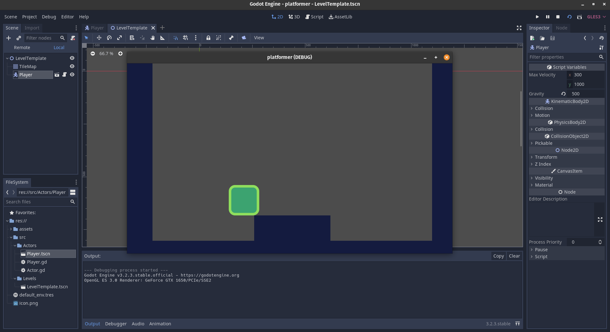

## Chapter 4: Setting Physics Layer

`Menu bar > Project > Project Settings > Layer Names (in Left Panel) > 2d Physics > Name your physics layer`

Set the following:

* Layer 1 -- player
* Layer 2 -- enemies
* Layer 3 -- coins
* Layer 4 -- world

Now we need to set the `collision_layer` and collision `collision_mask` for the various scenes. Please follow this link for getting the detail description of them: 

https://godotengine.org/qa/4010/whats-difference-between-collision-layers-collision-masks

`TileMap > Inspector > Collision > Layer > select world`
`TileMap > Inspector > Collision > Mask > deselect all`

Basically this means that `TileMap` will reside in world layer and it won't scan for any collisions.

Similarly for player:

`Player.tscn > Inspector > PhysicsBody2D > Collision > Layer > select player`

`Player.tscn > Inspector > PhysicsBody2D > Collision > Mask > select world`

This means that any instance of `Player` by default will reside in player layer and it will scan for any collisions with any object in world layer.

## Chapter 5: Coding the input

To set up the movement keys to control the player:

`Project > Project Settings > Input Map`

Set the following keymaps:

* move_left -- A
* move_right -- D
* jump -- W

Add the movement code to `Player.gd` script.

This code will contain the following:

* handling move_left, move_right and jump
* jump only when on floor 
* implementing interrupt jump like mario

Here is a demo:

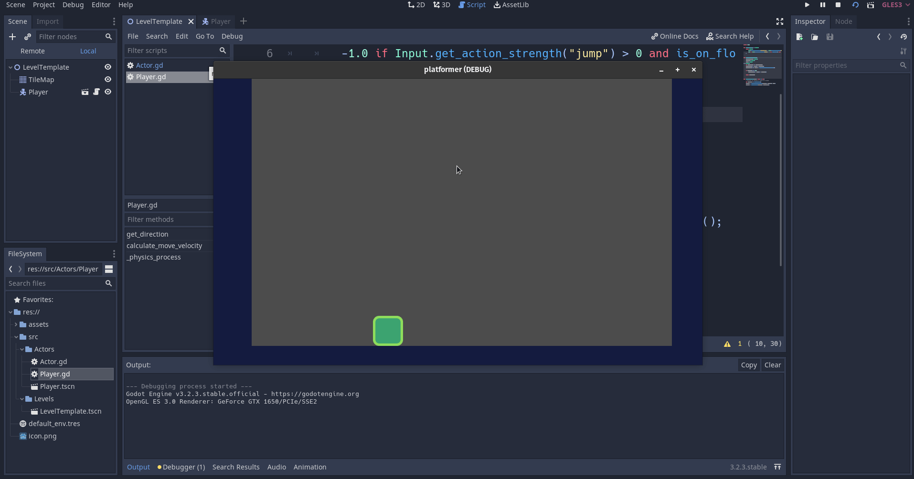

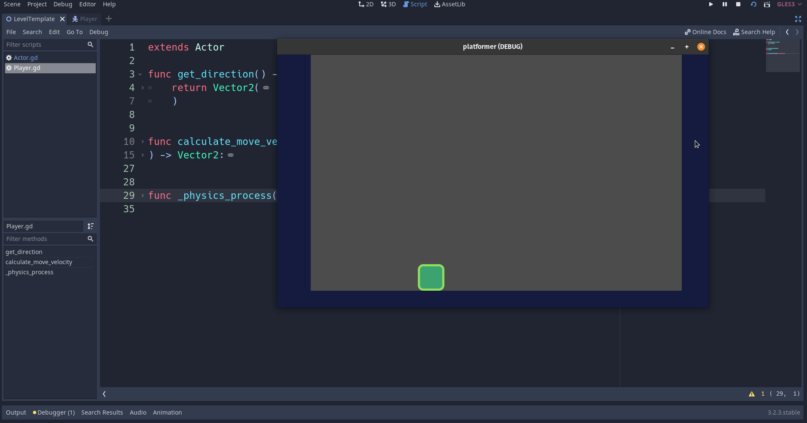

> A private variable in GDScript starts with underscore character.

## Chapter 6: Creating Enemies

Duplicate `res://src/Actors/Player.tscn` to create an `res://src/Actors/Enemy.tscn`.

Rename the scene and sprite name while selecting `Enemy.tscn` and then replace the sprite of the enemy node. 

`Select Enemy Scene > Right Click > Extend Script > Inherit from Actor.gd`

Change `collision_layer` to `enemies` layer and `collision_mask` to `player` and `world`.

Add code for changing the direction when hit wall. At this point you will have a demo like this:

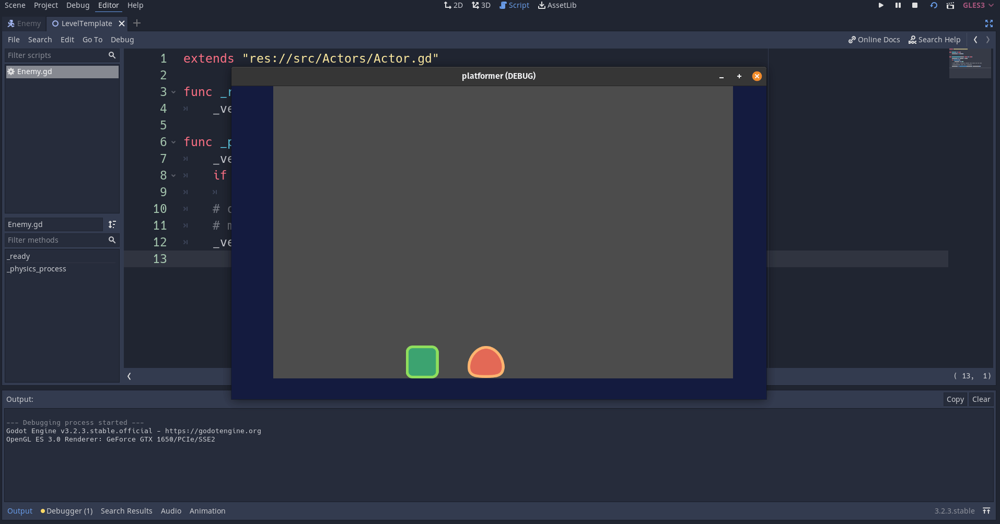

## Chapter 7: Optimizing with VisibilityEnabler2D

First optimization is to stop processing physics when enemy is out of view. To do this add `VisibilityEnabler2D` child node to `Enemy` node and enable `process_parent` and `physics_process_parent` for this node. This will stop the `_physics_process()` when enemy go out of the view, but we also need to stop the `_physics_process()` when the enemy is out of the scene when the game starts. This can be done within the code by adding `set_physics_process(false)` in `_ready()` for enemy.

Also, you need to adjust the size of the `VisibilityEnabler2D` node.

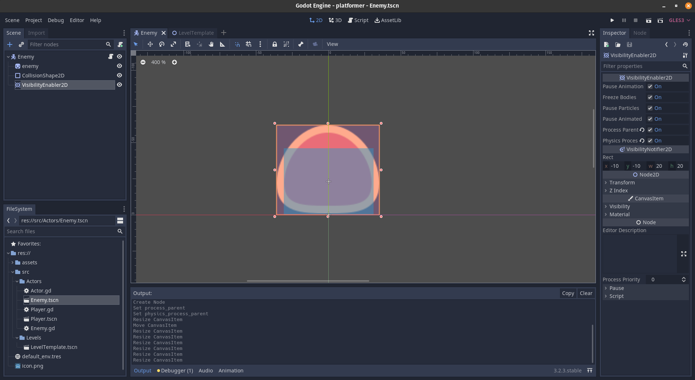

> Ctrl + Shift + O : open a scene

Now we need to add `Camera2D` to test visibility enabler in action.

`Player > Add Camera2D child node > Check the current property for Camera2D node`

Here is the demo at this step.

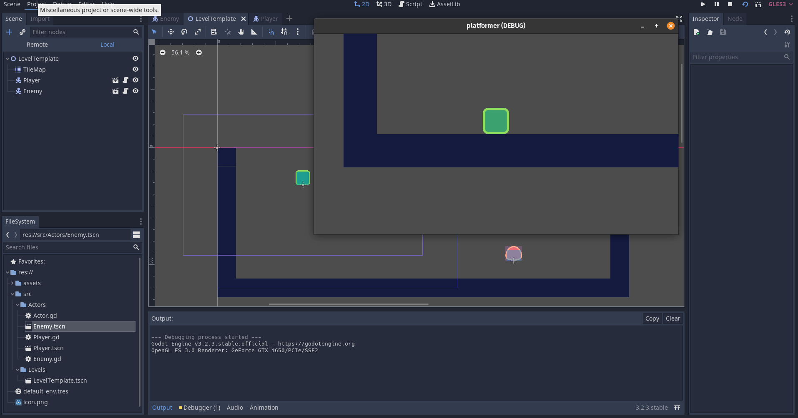

## Chapter 8: Stomping the Enemy

Adding a new `Area2D` node above enemy to detect the stomp. Call it `StompDetector`. Select the enemies `collision_layer`. Now add a child node `CollisionShape2D` and select rectangle shape. Size the shape appropriately. Change the color of `StompDetector` or `CollisionShape2D` so it can be distinguished easily.

`StompDetector > Inspector > CanvasItem > Visibility > Modulate`

This color will be visible if `Debug > Visible Collision Shape` is checked.

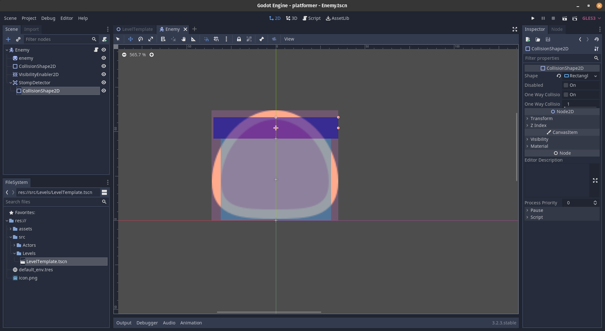

Now we need to add signals so that when a player enter the stomp detector regeion we react to that. You can click on the `Node` panel on the right hand side of the godot UI to see the list of signals emitted for any particular node.

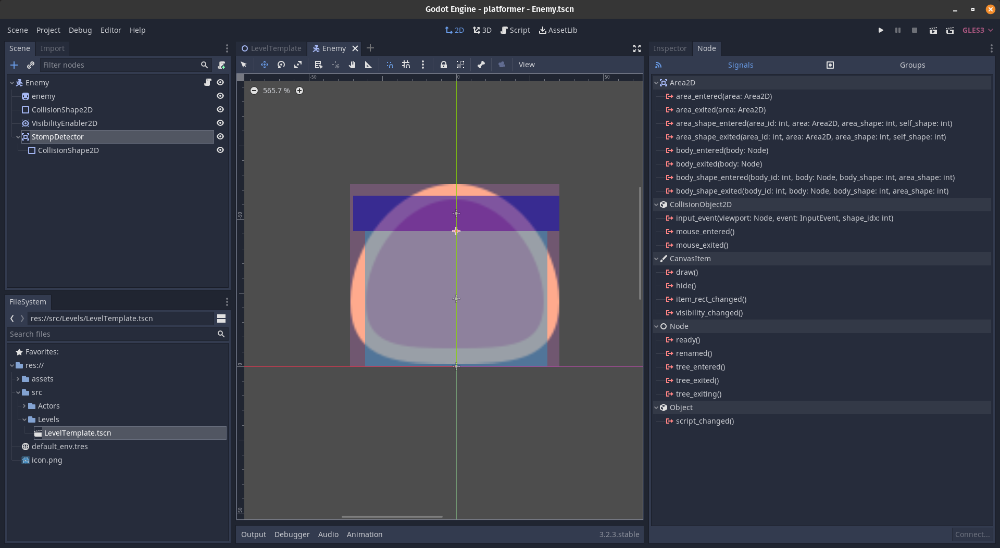

We will use `body_entered` signal which detects the entry of `PhysicalBody2D`. Double click on that signal and a window will appear which will allow us to connect that signal to a method for the `Enemy` node.

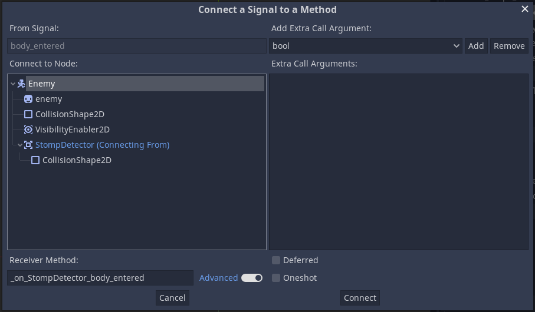

Noow we need to complete the `func _on_StompDetector_body_entered(body: Node) -> void:` to make the enemy die. 

Here is the demo:

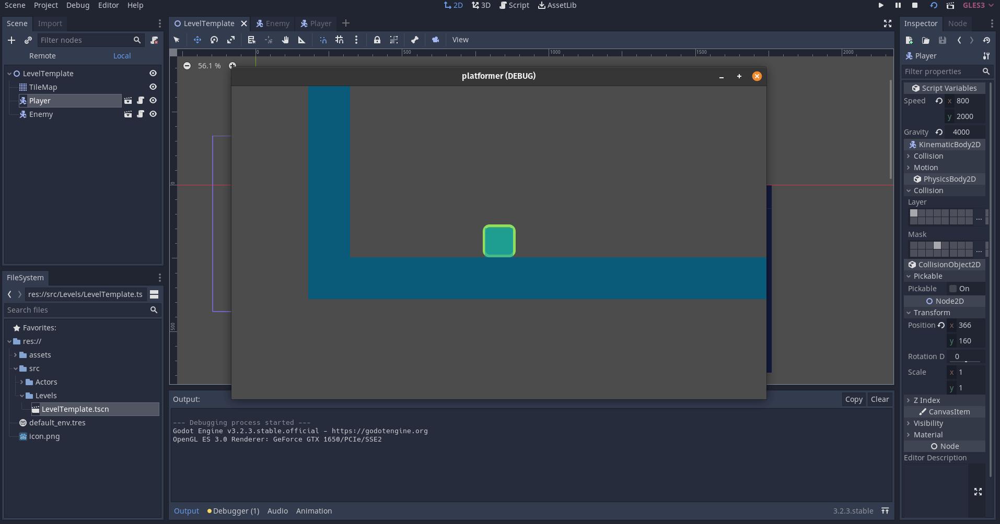

Now we need to add the stomping related code for the player node. Similar to `StompDetector` node for the enemy add one `EnemyDetector` for player. Select enemies layer for `collision_mask`. And connect a method to signal `area_entered` and add logic for stomp pulse.

Here is the demo:

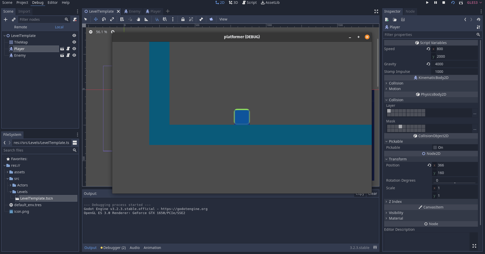

## Chapter 9: Player's Death

Defining `body_entered` signal for `EnemyDetector`. here is the demo:

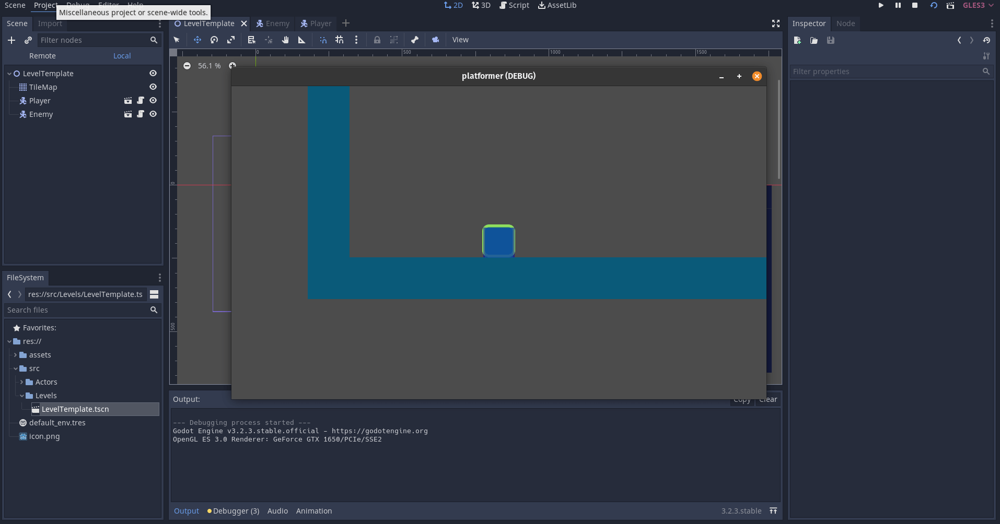

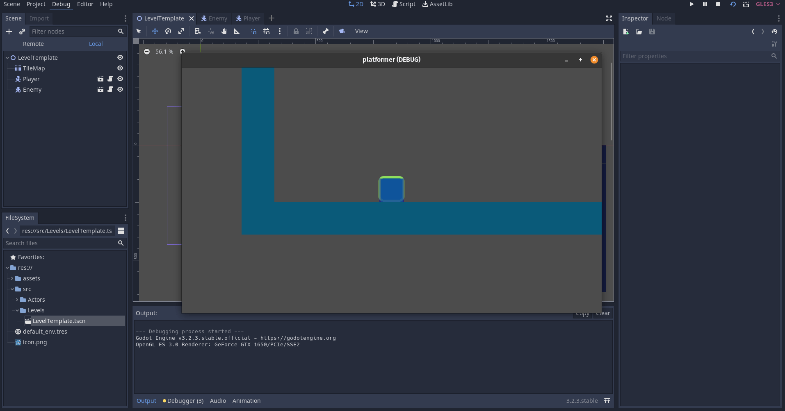

> Important: You have to adjust the size of EnemyDetector margin and StompDetector size to get correct working code. Shown below is a demo where a non-appropriate size of the StompDetector will screw up the stomp function. 

## Chapter 10: Improving the camera

First make the `LevelTemplate` bigger.

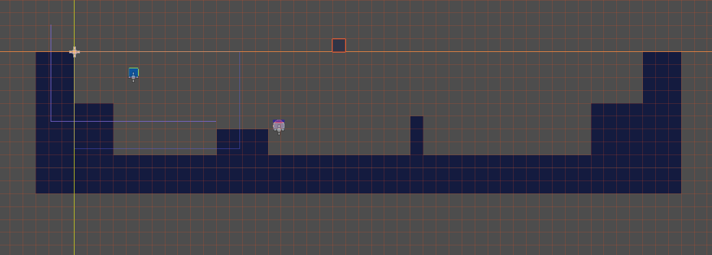

Now we need to change `Camera2D` properties in the `Player` scene.

Set the `limit_left` and `limit_top` property to `0`. This will limit the camera's `x` and `y` coordinate. Hence, camera area can't go in an area where `x < 0` or `y < 0`. Also, turn on the `limit_smoothed` property. This will smoothen the camera movement.

Now set the `drag_margin_left` and `drag_margin_right` to `0`. As `drag_margin` specifies the margin to drag the camera and we want our camera to be centered around the player along the horzontal axis. Also, enable `drag_margin_h_enabled` and `drag_margin_v_enabled` property, otherwise `drag_margin` properties wouldn't do anything.

To move camera smoothly enable the `smoothing_enabled` option.

## Chapter 11: Creating a mini level and adding background

Add a background by draging `res://assests/background.png` holding Alt key and select `TextureRect` type.

Finally add a `CanvasLayer` and move it to make top child of the `LevelTemplate`. Make the `background` to be a child of `CanvasLayer`.

Here is the demo:

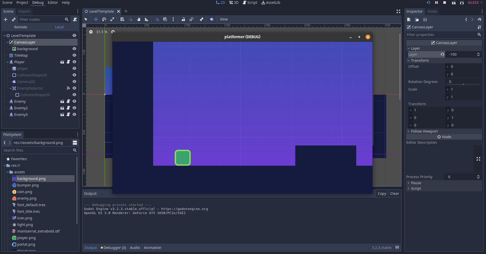

## Chapter 12: Creating coin scene

In godot, to make an interactive body you have 2 choices in general, either it can be a body or an area.

Create a new `Area2D` scene name it `Coin`, and add the sprite. Now add a `CollisionShape2D` to detect collisions and add a `AnimationPlayer` node. Save it in the location `res://src/Objects/Coin.tscn`.

## Chapter 13: Create coin animation

`Botton Panel > Animation > create a bouncing animation`

Set the animation time for 1.2 and turn on the animation looping and on the top bar uncheck the rotation mask for inserting keys.

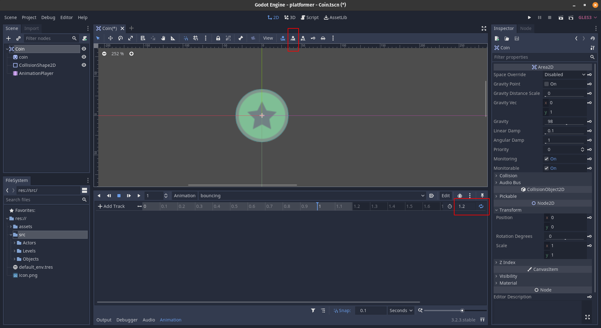

Create two keys with coin at y=10 and y=-10. And set some easing effect to get a non-linear feel. Here is the demo:

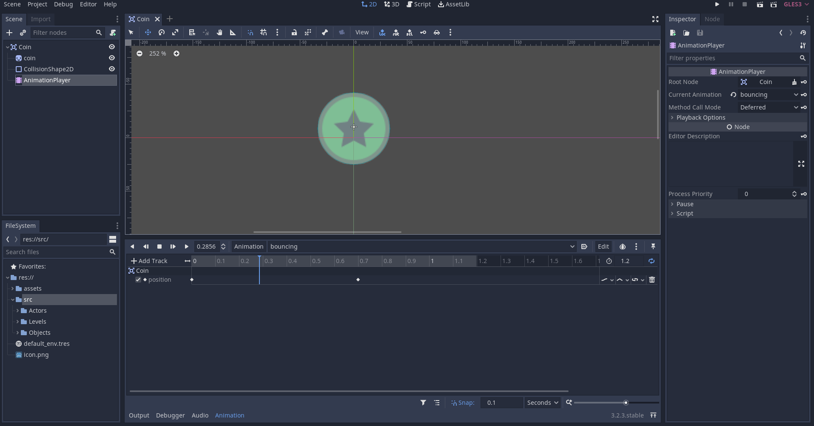

Create a new animation and name it `fade_out`. To fadeout we need to animate the modulate property of the coin. To get a key frame click the key icon next to the modulate property.

Also add a modulate property to the bouncing animation, because animations change the global property, and when we plat the fadeout animation it may affect the visibility of coin in bouncing animation therefore adding a constant modulate property in bouncing animation makes sure that it's value is reassigned.

Then add a function callback (`fade_out > Add Track > Call Method Track`) to delete the coin node once the fading animation is over.

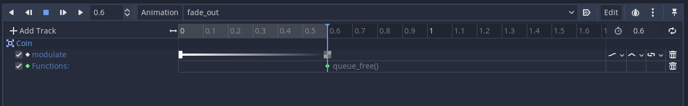

Enable autoplay on load for bouncing animation.

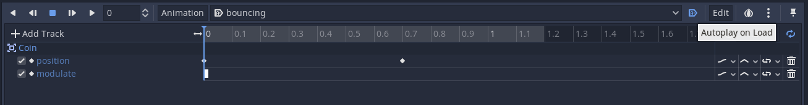

## Chapter 14: Coding the coin

Creat the code: `res://src/Objects/Coin.gd`

Store the reference of animation player that we can use with `onready var`.

`onready var anim_player : AnimationPlayer = get_node("AnimationPlayer")`

Set the `collision_layer` to `coins` and `collision_mask` to `player`. Then, connect the `body_entered` signal.

**BUG:** Instead of animating the coin, we need to animate the sprite. To do that simply edit the `.:position` name to `coin:position` where left of `:` is the node name and right of `:` is property. This will animate the sprite without moving the collision shape.

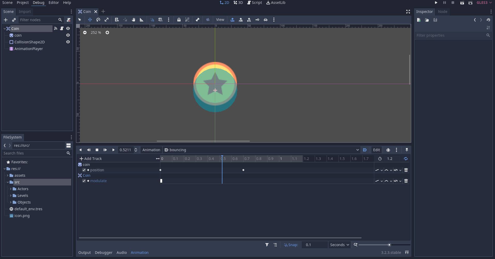

Now add a few coins to the level and test it.

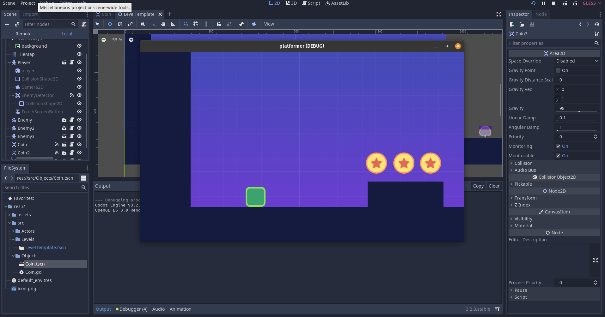

## Chapter 15: Creating a portal

As usual to create an interactive node we need to add: 1.) `Area2D` and 2.) `CollisionShape2D`. Let's create a `Portal2D` using `Area2D` node. Drop the sprite and add a collision shape with capsule shape.

Next step is to add node to transition our screen to black (when the portal is taken). Add a `CanvasLayer2D`, name it `TransitionLayer` and set its layer property to 100 to make sure our tansition effect is above everything in the game. Add a `ColorRect` child node to `TransitionLayer` to fill the screen with black color. And change its layout to `Full Rect` and change its color to black and set it to be trasparent in the beginning of the game, then we will animate the transparency while transitioning.

Add an `AnimationPlayer` node to the `Portal2D` node and add a default animation called `START` and enable autoplay on load option for this animation. The purpose of this animation is just to make the color rectangle transparent in the beginning and turn off the visibility. This will let us to perform lazy rendering of the portal transition scene only when it is required in future, which will improve performance for the low end devices. And make the animation `0 seconds` long.

> Note: Even if you set the `ColorRect` to be transparent in the beginning but not make it invisible, the graphic card has to render each pixels. Hence, it is wise to turn off visibility if the scene is not required.

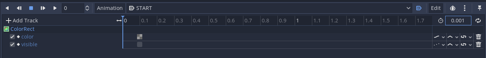

Now create a duplicate animation and name it `fade_in`. This animation will set the node to be visible. Set the length of animation 1s and insert another color key frame at the end side to be non-transparent.

Save it: `res://src/Objects/Portal2D.tscn`

## Chapter 16: Coding the teleportation

Turn off all the bits in `collision_layer` and `collision_mask` to player bit and make the portal non-monitorable.

Add code for teleportation so that when any player touches it, they can teleport.
Add an exported variable `next_scene : PackedScene` which will store the next scene data.
Also define the function `_get_configuration_warning()` to get a warning if `next_scene` is empty or not initialized.

Also add an `onready var anim_player : AnimationPlayer` which stores the reference of animation player node for the portal. This can be done in 2 way:

1. `onready var anim_player : AnimationPlayer = get_node("AnimationPlayer")`
2. `onready var anim_player : AnimationPlayer = $AnimationPlayer`

Both are same.
Now define a `teleport()` function which whill change the scenes.
Now we need to detect when the player enters the portal then call the `teleport()` function.
Then create a new level to test the teleport.

Now all that left is to design level 1 of the game.

> Distraction free mode : Ctrl + Shift + F11
> Select complex tiles : Ctrl + B

At this point we are going to have another mini release.

## Chapter 17: Designing the title screen

> Important: Designing in godot is similar to designing in HTML/CSS. Relative designing is done by Layout option for UI elements.

In godot all of the user interface related nodes have green icons.

Add a new `User Interface` node, and name it `MainScreen`.

Drag and drop `background.png` on the `MainScreen` scene holding the `Alt` button to change the type to `TextureRect`. Then adjust the layout to `Full Rect`, this will move and resize the background tecture so that it fits the full rectangle of its parent. Then enable `expand` property and change the `stretch_mode` to the `Tile`.
Now add a `Label` node for a title box and name it `Title`. With the `Title` box selected change the text, for eg., "my first godot game".
Add Play and Quit `Button` nodes. Add these 2 buttons to a `VBoxContainer` (named as `Menu`) which is centered on the `MainScreen`.

Save the following scenes as separate scenes.

1. `PlayButton` -- `res://src/UserInterface/PlayButton.tscn`
2. `QuitButton` -- `res://src/UserInterface/QuitButton.tscn`
3. `Title` -- `res://src/UserInterface/Title.tscn`
4. `MainScreen` -- `res://src/Screens/MainScreen.tscn`

There is no specific reason for above, other than a proper code organization.

Next step is to change the font. Please follow the below link foor an excellent tutorial on font creation for Godot game.

https://youtu.be/mjWwWIEyib8?t=839

## Chapter 18: Coding the buttons

Rename the `PlayButton` to `ChangeSceneButton` at the following location: `res://src/UserInterface/PlayButton.tscn`

Implement the `ChangeSceneButton`'s `button_up()` signal to change the scene. You can export a variable for storing the next scene path like this:

`export(String, FILE) var next_scene_path := ""`

This will allow us to set the next scene through the inspector panel.
Also, add a warning to prompt if next scene path is empty.

Then add the script for the `QuitButton`'s signal `button_up()`.

## Chapter 19: End Scene

`res://src/Screens/EndScene.tscn`

You can take the `TextureRect` scene directly from `MainScreen` by merge from scene option.
Drag and drop the created UI resource theme.
Similarly, create a `Label` node for score and a `Title` node.
